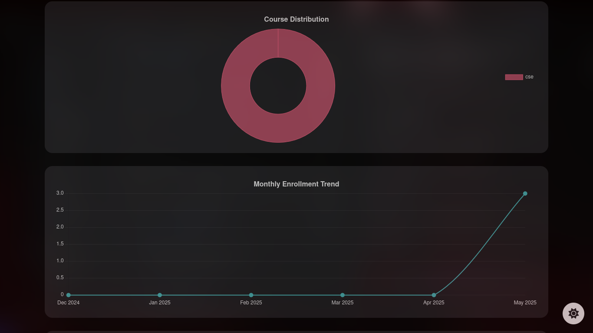
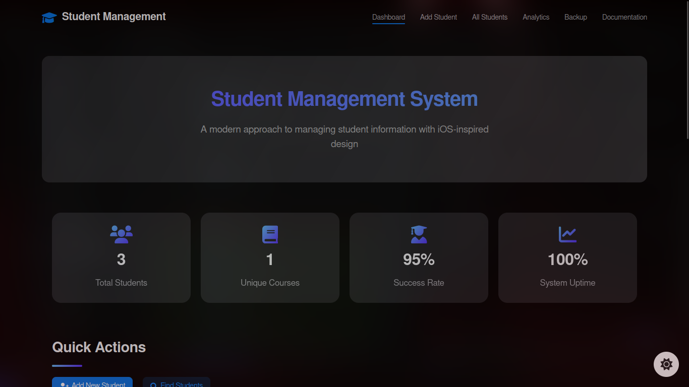

# Student Management System - Royal Global University

A modern, responsive web application for managing student records in the Computer Science Department of Royal Global University.

## 📷 Screenshots

All screenshots are stored in the `screenshots` directory. Add your own screenshots to showcase the application.


> Add a screenshot of your dashboard here

### Analytics Page



> Add a screenshot of your analytics page here


### Dashboard


> Note: Add your screenshots to the `screenshots` folder to display them here.

## 🚀 Features

- **Modern UI/UX**
  - Responsive design for all devices
  - Dark/Light theme support
  - Glassmorphism design elements
  - iOS-style notifications

- **Student Management**
  - Add new students
  - View all students with pagination
  - Edit student information
  - Delete student records
  - Real-time search functionality

- **Dashboard**
  - Quick action cards
  - Recently added students overview
  - Department information
  - Theme toggle functionality

- **Analytics**
  - Visual data representation
  - Student enrollment trends
  - Course distribution charts

- **Documentation**
  - Auto-detection of markdown files
  - Apple-style UI/UX
  - Syntax highlighting for code

- **Backup System**
  - Database backup creation
  - Restore functionality
  - Auto-dated backup files

## 🛠️ Technical Stack

- **Frontend**
  - HTML5
  - CSS3 (with modern features)
  - Font Awesome Icons

- **Backend**
  - PHP 7.4+
  - MySQL Database


## 📋 Prerequisites

- PHP 7.4 or higher
- MySQL 5.7 or higher
- Web server (Apache/Nginx)
- mod_rewrite enabled (for Apache)

## 💻 Installation

1. **Database Setup**

   ```sql
   mysql -u root -p < setup.sql
   ```

2. **Directory Permissions**

   ```bash
   chmod -R 755 /path/to/student-management-system
   chmod -R 777 /path/to/student-management-system/assets/images
   ```

3. **Access Application**

   Navigate to: [`http://localhost/sachin/`](http://localhost/sachin/)

## 🔧 Configuration

### Database Credentials

```php
$servername = "localhost";
$username = "student_admin";
$password = "omesh2001";
$dbname = "student_management";
```

### Theme Settings

- Default theme can be configured in `assets/css/style.css`
- Theme preferences are stored in browser cookies

### Pagination

- Default items per page: 10 (adjustable in view_students.php)
- Configure in `view_students.php`:

  ```php
  $limit = 10; // Change this value
  ```

## 🔐 Security Features

- SQL Injection Prevention
  - Prepared Statements
  - Parameter Binding

- XSS Prevention
  - HTML Escaping
  - Input Validation

## 👥 Contributors

- Developer: Omesh Thokchom
- Email: thokchomdayananda54@gmail.com
- Department: Computer Science, Royal Global University

## 📱 Responsive Breakpoints

- Mobile: 320px - 480px
- Tablet: 481px - 768px
- Desktop: 769px - 1024px
- Large Desktop: 1025px+

## 📑 Documentation

Detailed documentation can be found in the `documentation.php` page of the application. The system automatically reads Markdown files from the `docs` directory.

Existing documentation includes:

- System Documentation - General overview of all features
- Technical Deep Dive - Implementation details and advanced topics
- User Guide - Step-by-step instructions for users

To add new documentation:

1. Create a Markdown file in the `docs` directory
2. Follow the existing documentation format
3. Access via the Documentation link in the main navigation

## 🎨 Theme Colors

```css
:root {
    --primary-color: #2196F3;
    --primary-dark: #1976D2;
    --text-light: #2c3e50;
    --text-dark: #ffffff;
}
```

## 📄 License

This project is licensed under the MIT License - see the [LICENSE](LICENSE) file for details.

## 📞 Support & Contact

For support:

- Email: thokchomdayananda54@gmail.com
- Phone: Contact CS Department
- Location: Royal Global University, Guwahati, Assam

## 🙏 Acknowledgments

- Royal Global University CS Department
- [Font Awesome](https://fontawesome.com/) for icons
- Contributors and testers

---
Made with ❤️ by Omesh Thokchom for Royal Global University
